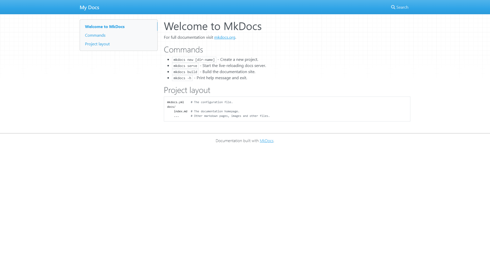
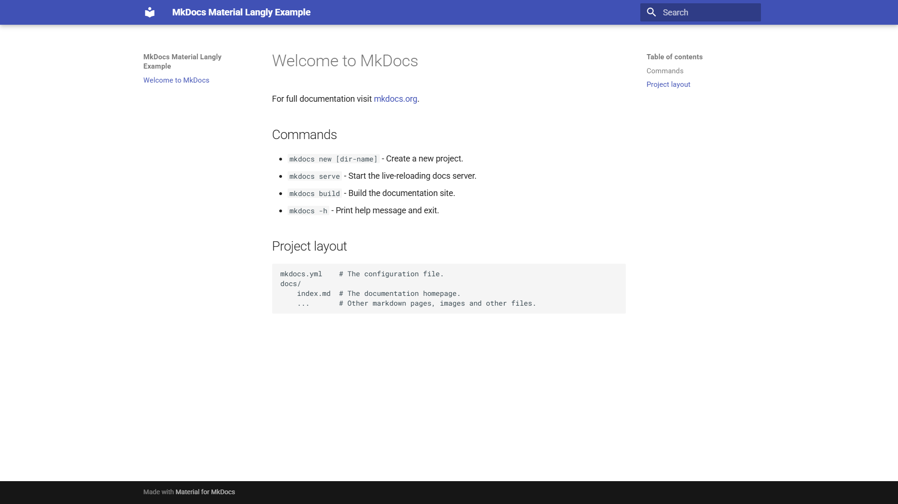

# [[Wie erstellt man ein mehrsprachiges Webseiten- oder Dokumentations-Projekt mit MkDocs, Material, und Langly?]]


[Designed by Freepik](http://www.freepik.com){:target="_blank"}

[[Für alle, die eine mehrsprachige Webseite erstellen möchten, bietet MkDocs in Kombination mit dem Material-Theme und dem Langly-Plugin eine hervorragende Lösung. In diesem Beitrag wird detailliert beschrieben, wie Sie eine internationale Webseite oder ein Dokumentationsprojekt mit MkDocs, Material und Langly erstellen können. Die Anleitung umfasst die Vorbereitung des Projekts, die Installation von MkDocs und Material sowie die anschließende Übersetzung der Inhalte mit Langly. Diese Schritt-für-Schritt-Anleitung richtet sich an Benutzer, die ein mehrsprachiges Web-Projekt erstellen möchten.]]

<!-- more -->

## [[Voraussetzungen]]

[[Um dieser Anleitung hier zu folgen werden einige Voraussetzungen benötigt. Prinzipiell sind abweichende Wege möglich aber um alles so einfach wie möglich zu halten, werden die hier gezeigten Schritte in Visual Studio Code durchgeführt.]]

- [x] [[Einen GitHub-Account um das Web-Projekt später zu veröffentlichen.]]
- [x] [[Ein installiertes Python auf dem System und Visual Studio Code als Editor.]]
- [x] [[Einen DeepL-Free oder höherwertigen Account.]]

## [[Los geht's]]

### [[GitHub Repository erstellen]]

[[Da später die Webseite oder Dokumentation im Internet (GH-Pages) veröffentlicht werden soll, wird ein GitHub-Repository benötigt. Man kann dieses über die GitHub-Webseite erstellen, was sich empfiehlt, da so auch gleich eine `.gitignore`-Datei erstellt werden kann die für dieses HowTo auch zwingend benötigt wird.]]

[[Im GitHub-Dashboard auf `New` klicken und schon geht der Spaß los.]]

1. [[Einen beliebigen `Repository-Name` eingeben.]]
2. [[Unter `Add .gitignore` bitte Python auswählen.]]
3. [[Und auf `Create Repository` klicken.]]

[[Alle weiteren Felder sind für dieses Beispiel optional aber sollten natürlich auf die eigenen Bedürfnisse angepasst werden.]]

### [[Repository klonen]]

[[Um das zuvor angelegte Repository zu klonen, navigiert man in VS Code zur *Quellcodeverwaltung* und dann auf *Repository klonen*. Nach dem Auswählen des Repository mit dem zuvor bei GitHub erstellten Namen, wird das Repository in das gewählte Arbeitsverzeichnis geklont.]]

### [[Virtuelles Python-Environment einrichten]]

[[Ist Python auf dem System installiert und die PATH Variable gesetzt ist die Einrichtung des `venv` sehr einfach. Man drückt in VS Code eigentlich nur die `F1`-Taste und wählt *Python: Umgebung erstellen...* aus.]]

[[Im folgenden Dialog wählt man *Venv* und danach den Interpreter Pfad der installierten oder bevorzugten Python-Version.]]

[[Boom! Da ist ein `venv`.]]

[[Regulär aktiviert Visual Studio Code das `venv` dann auch automatisch, wenn eine Python-Datei geöffnet wird aber in unserem Fall wird das `venv` erst einmal für die Installation von MkDocs und Material benötigt und es existiert keine Python-Datei im Projekt-Verzeichnis.]]

[[Also navigiert man über das integrierte Terminal im Projekt-Stammverzeichnis in das `.venv`-Verzeichnis und danach in das `Scripts`-Verzeichnis und führt dort `activate`aus.]]

[[Es sollte nun ein `(.venv)` vor dem Pfad im Terminal erscheinen.]]

[[Weitere und detailliertere Informationen dazu gibt es auf dieser Webseite]]: [Python Environments in VS Code](https://code.visualstudio.com/docs/python/environments){:target="_blank"}


### [[MkDocs einrichten]]

[[Um MkDocs zu installieren wird im Terminal folgender Befehl ausgeführt.]]

```bash
pip install mkdocs
```

[[Nach dem alle Abhängigkeiten installiert wurden, müssen wir das Projekt noch erstellen. Dazu wird im Terminal folgender Befehl ausgeführt.]]

```bash
mkdocs new .
```

[[Jetzt folgt der Test.]]

```bash
mkdocs serve
```

[[Wenn alles geklappt hat, sollte im Browser unter `http://127.0.0.1:8000/` die MkDocs-Startseite erscheinen.]]



### [[Material-Theme einrichten]]

[[Um das Material-Theme zu installieren wird im Terminal folgender Befehl ausgeführt.]]

```bash
pip install mkdocs-material
```

[[Nach der Installation muss das Material-Theme noch in der `mkdocs.yml`-Konfigurationsdatei aktiviert werden. Dazu wird in der Datei folgender Eintrag hinzugefügt.]]

```yaml
site_name: <Your Site Name>
theme:
  name: 'material'
```

[[Beim nächsten `mkdocs serve` sollte dann auch das Material-Theme aktiviert sein.]]



### [[Langly-Plugin einrichten]]

[[Jetzt wird noch das Langly-Plugin installiert. Dazu wird im Terminal folgender Befehl ausgeführt.]]

```bash
pip install mkdocs-material-langly
```

[[Nach der Installation muss das Langly-Plugin in der `mkdocs.yml`-Konfigurationsdatei aktiviert und eingerichtet werden. Hierfür sind die Werte `source` und `targets` mit den gewünschten Sprachen auszufüllen. Die Quellsprache ist die Sprache, in der die Webseite oder Dokumentation erstellt wird, während die Zielsprachen die Sprachen sind, in die die Webseite oder Dokumentation übersetzt werden soll.]]

!!!warning
    [[Wichtig ist, dass das Langly-Plugin in der Reihenfolge der Plugins als **letztes** aufgeführt wird.]]

```yaml
plugins:
  - search
  - langly:
      lang_switch: true
      source:
          name: English
          lang: en
      targets:
        - name: Deutsch
          lang: de
        - name: Español
          lang: es
        - name: Français
          lang: fr
        - name: Italiano
          lang: it
```

[[Die hier gewählten Sprachen sind nur Beispielhaft und können selbstverständliche auf das eigene Vorhaben angepasst werden.]]

### [[DeepL-Api-Key bereitstellen und schützen]]

[[Jetzt wird der DeepL-Api-Key benötigt. Diesen erhält man, indem man ein DeepL-Free-Konto erstellt. Sobald der Api-Key generiert wurde, wird eine Datei mit dem Namen `auth_key.json` im Hauptverzeichnis des Projekts angelegt und der Api-Key dort eingetragen.]]

```json
{
    "deepl": "DEEPL-API-KEY"
}
```
!!!warning
    [[Bitte den Api-Key in der `.gitignore`-Datei ausschließen und auch auf jede erdenkliche Weise vor dem Upload ins Internet schützen.]]

[[Um das zu erreichen wird eine neue Zeile mit folgendem Inhalt in der `.gitignore`-Datei hinzugefügt.]]

```bash
auth_key.json
```

### [[Übersetzung starten]]

[[Jetzt sind wir im Grunde genommen bereit, mit der Übersetzung zu beginnen. Um dies zu erreichen, wird der zu übersetzende Inhalt in den Markdown-Dateien einfach maskiert, und das Langly-Plugin übernimmt den Rest. Die Maskierung erfolgt, indem der zu übersetzende Text mit `{[` und `]}` umschlossen wird.]]

[[Probieren wir es einfach an der `index.md`-Datei aus, die sich im `docs` Verzeichnis im Projekt befindet.]]

[[Diese sieht im Augenblick so aus.]]

```markdown
# Welcome to MkDocs

For full documentation visit [mkdocs.org](https://www.mkdocs.org).

## Commands

* `mkdocs new [dir-name]` - Create a new project.
* `mkdocs serve` - Start the live-reloading docs server.
* `mkdocs build` - Build the documentation site.
* `mkdocs -h` - Print help message and exit.

## Project layout

    mkdocs.yml    # The configuration file.
    docs/
        index.md  # The documentation homepage.
        ...       # Other markdown pages, images and other files.
```

[[Eine einfache Maskierung ist völlig ausreichend. Fokussieren Sie sich auf die spezifischen Texte, die übersetzt werden müssen, und vermeiden Sie übermäßige Maskierung. Das bedeutet, dass Sie lediglich die relevanten Textteile mit den Maskierungszeichen `{[` und `]}` umschließen sollten, um eine präzisere Übersetzung zu ermöglichen. Bei mehreren Sätzen sollte selbstverständlich der gesamte Abschnitt maskiert werden, damit DeepL den Kontext besser erfassen kann.]]

[[In unserem Beispiel wäre dies dann am sinnvollsten.]]

```markdown
# {[Welcome to MkDocs]}

{[For full documentation visit]} [mkdocs.org](https://www.mkdocs.org).

## {[Commands]}

* `mkdocs new [dir-name]` - {[Create a new project.]}
* `mkdocs serve` - {[Start the live-reloading docs server.]}
* `mkdocs build` - {[Build the documentation site.]}
* `mkdocs -h` - {[Print help message and exit.]}

## {[Project layout]}

    mkdocs.yml    # {[The configuration file.]}
    docs/
        index.md  # {[The documentation homepage.]}
        ...       # {[Other markdown pages, images and other files.]}
```

[[Bei der nächsten Ausführung von `mkdocs serve` werden alle maskierten Texte automatisch übersetzt, die Delimiter entfernt und die Quell- sowie Zielsprache korrekt auf der Seite angezeigt. Das Sprachmenü ermöglicht es dann, zu den einzelnen Sprachversionen zu navigieren.]]

### [[Übersetzung manuell verfeinern]]

Falls die automatische Übersetzung unzureichend ist oder bestimmte Zeichen oder Formatierungen nicht richtig übersetzt wurden, besteht die Möglichkeit, die entsprechenden JSON-Dateien im Verzeichnis `locales` im Hauptverzeichnis des Projekts zu bearbeiten.

Der Inhalt der `index.json` der deutschen Sprachvariante sieht jetzt so aus.

```json
{
    "Welcome to MkDocs": {
        "__active__": true,
        "de": "Willkommen bei MkDocs"
    },
    "For full documentation visit": {
        "__active__": true,
        "de": "Die vollst\u00e4ndige Dokumentation finden Sie unter"
    },
    "Create a new project.": {
        "__active__": true,
        "de": "Erstellen Sie ein neues Projekt."
    },
    "Start the live-reloading docs server.": {
        "__active__": true,
        "de": "Starten Sie den live-reloadenden Doku-Server."
    },
    "Build the documentation site.": {
        "__active__": true,
        "de": "Erstellen Sie die Dokumentationsseite."
    },
    "Print help message and exit.": {
        "__active__": true,
        "de": "Hilfemeldung drucken und beenden."
    },
    "Project layout": {
        "__active__": true,
        "de": "Projekt-Layout"
    },
    "The configuration file.": {
        "__active__": true,
        "de": "Die Konfigurationsdatei."
    },
    "The documentation homepage.": {
        "__active__": true,
        "de": "Die Homepage der Dokumentation."
    },
    "Other markdown pages, images and other files.": {
        "__active__": true,
        "de": "Andere Markdown-Seiten, Bilder und andere Dateien."
    }
}
```

[[Jeder Datensatz beinhaltet den Sprachschlüssel als Attributnamen, während der übersetzte Text im untergeordneten Attribut `de` als Wert dargestellt wird. Solange der Sprachschlüssel konstant bleibt, wird Langly immer den Text des `de`-Attributs in diesem Beispiel nutzen. Sollte der Sprachschlüssel versehentlich verändert werden, kann Langly die Zuordnung nicht mehr korrekt durchführen, was dazu führt, dass die Übersetzung erneut vorgenommen wird und der manipulierte Datensatz entfernt wird.]]

[[Das `__active__`-Attribut wird von Langly genutzt, um festzustellen, ob der Datensatz weiterhin benötigt wird, und entfernt ihn bei der nächsten Ausführung.]]